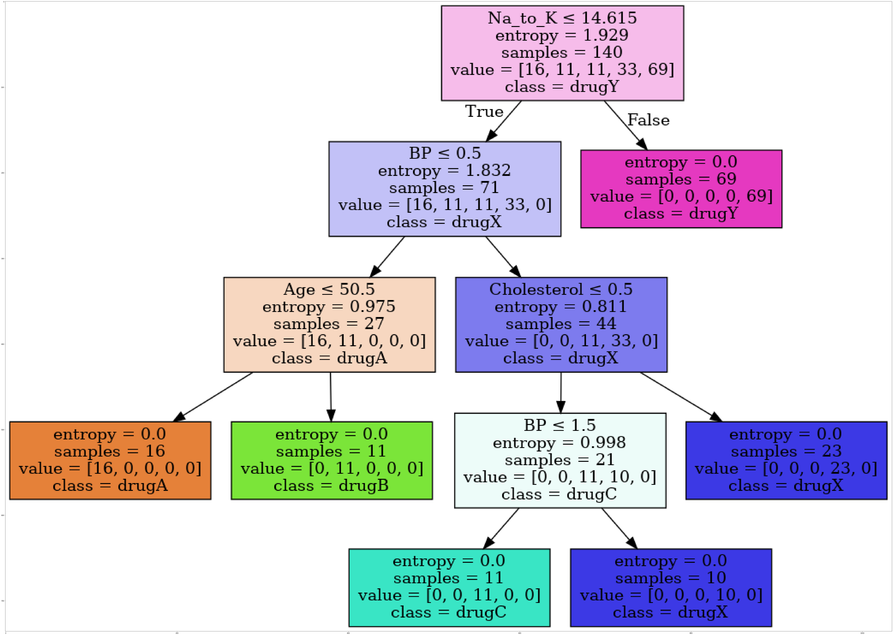

<a href="https://www.bigdatauniversity.com"></a>

<h1><center>Decision Trees</center></h1>

In this lab exercise, you will learn a popular machine learning algorithm, Decision Tree. You will use this classification algorithm to build a model from historical data of patients, and their response to different medications. Then you use the trained decision tree to predict the class of a unknown patient, or to find a proper drug for a new patient.

<h1>Table of contents</h1>

<div class="alert alert-block alert-info" style="margin-top: 20px">
    <ol>
        <li><a href="#about_dataset">About the dataset</a></li>
        <li><a href="#downloading_data">Downloading the Data</a></li>
        <li><a href="#pre-processing">Pre-processing</a></li>
        <li><a href="#setting_up_tree">Setting up the Decision Tree</a></li>
        <li><a href="#modeling">Modeling</a></li>
        <li><a href="#prediction">Prediction</a></li>
        <li><a href="#evaluation">Evaluation</a></li>
        <li><a href="#visualization">Visualization</a></li>
    </ol>
</div>
<br>
<hr>

Import the Following Libraries:
<ul>
    <li> <b>numpy (as np)</b> </li>
    <li> <b>pandas</b> </li>
    <li> <b>DecisionTreeClassifier</b> from <b>sklearn.tree</b> </li>
</ul>


```python
import numpy as np 
import pandas as pd
from sklearn.tree import DecisionTreeClassifier
```

<div id="about_dataset">
    <h2>About the dataset</h2>
    Imagine that you are a medical researcher compiling data for a study. You have collected data about a set of patients, all of whom suffered from the same illness. During their course of treatment, each patient responded to one of 5 medications, Drug A, Drug B, Drug c, Drug x and y. 
    <br>
    <br>
    Part of your job is to build a model to find out which drug might be appropriate for a future patient with the same illness. The feature sets of this dataset are Age, Sex, Blood Pressure, and Cholesterol of patients, and the target is the drug that each patient responded to.
    <br>
    <br>
    It is a sample of binary classifier, and you can use the training part of the dataset 
    to build a decision tree, and then use it to predict the class of a unknown patient, or to prescribe it to a new patient.
</div>


<div id="downloading_data"> 
    <h2>Downloading the Data</h2>
    To download the data, we will use !wget to download it from IBM Object Storage.
</div>


```python
!wget -O drug200.csv https://s3-api.us-geo.objectstorage.softlayer.net/cf-courses-data/CognitiveClass/ML0101ENv3/labs/drug200.csv
```

    --2020-05-27 19:14:57--  https://s3-api.us-geo.objectstorage.softlayer.net/cf-courses-data/CognitiveClass/ML0101ENv3/labs/drug200.csv
    Resolving s3-api.us-geo.objectstorage.softlayer.net (s3-api.us-geo.objectstorage.softlayer.net)... 67.228.254.196
    Connecting to s3-api.us-geo.objectstorage.softlayer.net (s3-api.us-geo.objectstorage.softlayer.net)|67.228.254.196|:443... connected.
    HTTP request sent, awaiting response... 200 OK
    Length: 6027 (5.9K) [text/csv]
    Saving to: ‘drug200.csv’
    
    drug200.csv         100%[===================>]   5.89K  --.-KB/s    in 0.001s  
    
    2020-05-27 19:14:57 (10.1 MB/s) - ‘drug200.csv’ saved [6027/6027]
    


__Did you know?__ When it comes to Machine Learning, you will likely be working with large datasets. As a business, where can you host your data? IBM is offering a unique opportunity for businesses, with 10 Tb of IBM Cloud Object Storage: [Sign up now for free](http://cocl.us/ML0101EN-IBM-Offer-CC)

now, read data using pandas dataframe:


```python
my_data = pd.read_csv("drug200.csv", delimiter=",")
my_data[0:5]

```


<div>
<style scoped>
    .dataframe tbody tr th:only-of-type {
        vertical-align: middle;
    }

    .dataframe tbody tr th {
        vertical-align: top;
    }

    .dataframe thead th {
        text-align: right;
    }
</style>
<table border="1" class="dataframe">
  <thead>
    <tr style="text-align: right;">
      <th></th>
      <th>Age</th>
      <th>Sex</th>
      <th>BP</th>
      <th>Cholesterol</th>
      <th>Na_to_K</th>
      <th>Drug</th>
    </tr>
  </thead>
  <tbody>
    <tr>
      <th>0</th>
      <td>23</td>
      <td>F</td>
      <td>HIGH</td>
      <td>HIGH</td>
      <td>25.355</td>
      <td>drugY</td>
    </tr>
    <tr>
      <th>1</th>
      <td>47</td>
      <td>M</td>
      <td>LOW</td>
      <td>HIGH</td>
      <td>13.093</td>
      <td>drugC</td>
    </tr>
    <tr>
      <th>2</th>
      <td>47</td>
      <td>M</td>
      <td>LOW</td>
      <td>HIGH</td>
      <td>10.114</td>
      <td>drugC</td>
    </tr>
    <tr>
      <th>3</th>
      <td>28</td>
      <td>F</td>
      <td>NORMAL</td>
      <td>HIGH</td>
      <td>7.798</td>
      <td>drugX</td>
    </tr>
    <tr>
      <th>4</th>
      <td>61</td>
      <td>F</td>
      <td>LOW</td>
      <td>HIGH</td>
      <td>18.043</td>
      <td>drugY</td>
    </tr>
  </tbody>
</table>
</div>


<div id="practice"> 
    <h3>Practice</h3> 
    What is the size of data? 
</div>


```python
# write your code here

my_data.size

```


    1200


<div href="pre-processing">
    <h2>Pre-processing</h2>
</div>

Using <b>my_data</b> as the Drug.csv data read by pandas, declare the following variables: <br>

<ul>
    <li> <b> X </b> as the <b> Feature Matrix </b> (data of my_data) </li>
    <li> <b> y </b> as the <b> response vector (target) </b> </li>
</ul>

Remove the column containing the target name since it doesn't contain numeric values.


```python
X = my_data[['Age', 'Sex', 'BP', 'Cholesterol', 'Na_to_K']].values
X[0:5]
```


    array([[23, 'F', 'HIGH', 'HIGH', 25.355],
           [47, 'M', 'LOW', 'HIGH', 13.093],
           [47, 'M', 'LOW', 'HIGH', 10.113999999999999],
           [28, 'F', 'NORMAL', 'HIGH', 7.797999999999999],
           [61, 'F', 'LOW', 'HIGH', 18.043]], dtype=object)


As you may figure out, some features in this dataset are categorical such as __Sex__ or __BP__. Unfortunately, Sklearn Decision Trees do not handle categorical variables. But still we can convert these features to numerical values. __pandas.get_dummies()__
Convert categorical variable into dummy/indicator variables.


```python
from sklearn import preprocessing
le_sex = preprocessing.LabelEncoder()
le_sex.fit(['F','M'])
X[:,1] = le_sex.transform(X[:,1]) 


le_BP = preprocessing.LabelEncoder()
le_BP.fit([ 'LOW', 'NORMAL', 'HIGH'])
X[:,2] = le_BP.transform(X[:,2])


le_Chol = preprocessing.LabelEncoder()
le_Chol.fit([ 'NORMAL', 'HIGH'])
X[:,3] = le_Chol.transform(X[:,3]) 

X[0:5]

```


    array([[23, 0, 0, 0, 25.355],
           [47, 1, 1, 0, 13.093],
           [47, 1, 1, 0, 10.113999999999999],
           [28, 0, 2, 0, 7.797999999999999],
           [61, 0, 1, 0, 18.043]], dtype=object)


Now we can fill the target variable.


```python
y = my_data["Drug"]
y[0:5]
```


    0    drugY
    1    drugC
    2    drugC
    3    drugX
    4    drugY
    Name: Drug, dtype: object


<hr>

<div id="setting_up_tree">
    <h2>Setting up the Decision Tree</h2>
    We will be using <b>train/test split</b> on our <b>decision tree</b>. Let's import <b>train_test_split</b> from <b>sklearn.cross_validation</b>.
</div>


```python
from sklearn.model_selection import train_test_split
```

Now <b> train_test_split </b> will return 4 different parameters. We will name them:<br>
X_trainset, X_testset, y_trainset, y_testset <br> <br>
The <b> train_test_split </b> will need the parameters: <br>
X, y, test_size=0.3, and random_state=3. <br> <br>
The <b>X</b> and <b>y</b> are the arrays required before the split, the <b>test_size</b> represents the ratio of the testing dataset, and the <b>random_state</b> ensures that we obtain the same splits.


```python
X_trainset, X_testset, y_trainset, y_testset = train_test_split(X, y, test_size=0.3, random_state=3)
```

<h3>Practice</h3>
Print the shape of X_trainset and y_trainset. Ensure that the dimensions match


```python
# your code

print(X_trainset.shape)
print(y_trainset.shape)


```

    (140, 5)
    (140,)


Print the shape of X_testset and y_testset. Ensure that the dimensions match

<hr>

<div id="modeling">
    <h2>Modeling</h2>
    We will first create an instance of the <b>DecisionTreeClassifier</b> called <b>drugTree</b>.<br>
    Inside of the classifier, specify <i> criterion="entropy" </i> so we can see the information gain of each node.
</div>


```python
drugTree = DecisionTreeClassifier(criterion="entropy", max_depth = 4)
drugTree # it shows the default parameters
```


    DecisionTreeClassifier(class_weight=None, criterion='entropy', max_depth=4,
                max_features=None, max_leaf_nodes=None,
                min_impurity_decrease=0.0, min_impurity_split=None,
                min_samples_leaf=1, min_samples_split=2,
                min_weight_fraction_leaf=0.0, presort=False, random_state=None,
                splitter='best')


Next, we will fit the data with the training feature matrix <b> X_trainset </b> and training  response vector <b> y_trainset </b>


```python
drugTree.fit(X_trainset,y_trainset)
```


    DecisionTreeClassifier(class_weight=None, criterion='entropy', max_depth=4,
                max_features=None, max_leaf_nodes=None,
                min_impurity_decrease=0.0, min_impurity_split=None,
                min_samples_leaf=1, min_samples_split=2,
                min_weight_fraction_leaf=0.0, presort=False, random_state=None,
                splitter='best')


<hr>

<div id="prediction">
    <h2>Prediction</h2>
    Let's make some <b>predictions</b> on the testing dataset and store it into a variable called <b>predTree</b>.
</div>


```python
predTree = drugTree.predict(X_testset)
```

You can print out <b>predTree</b> and <b>y_testset</b> if you want to visually compare the prediction to the actual values.


```python
print (predTree [0:5])
print (y_testset [0:5])

```

    ['drugY' 'drugX' 'drugX' 'drugX' 'drugX']
    40     drugY
    51     drugX
    139    drugX
    197    drugX
    170    drugX
    Name: Drug, dtype: object


<hr>

<div id="evaluation">
    <h2>Evaluation</h2>
    Next, let's import <b>metrics</b> from sklearn and check the accuracy of our model.
</div>


```python
from sklearn import metrics
import matplotlib.pyplot as plt
print("DecisionTrees's Accuracy: ", metrics.accuracy_score(y_testset, predTree))
```

    DecisionTrees's Accuracy:  0.9833333333333333


__Accuracy classification score__ computes subset accuracy: the set of labels predicted for a sample must exactly match the corresponding set of labels in y_true.  

In multilabel classification, the function returns the subset accuracy. If the entire set of predicted labels for a sample strictly match with the true set of labels, then the subset accuracy is 1.0; otherwise it is 0.0.


## Practice 
Can you calculate the accuracy score without sklearn ?


```python
print(type(y_testset))
print("Actual value",y_testset[0:5])
print("Required value",y_testset.values[0:5])
```

    <class 'pandas.core.series.Series'>
    Actual value 40     drugY
    51     drugX
    139    drugX
    197    drugX
    170    drugX
    Name: Drug, dtype: object
    Required value ['drugY' 'drugX' 'drugX' 'drugX' 'drugX']


```python
# Initializing the match value as zero
match=0

#Find the size for iteration and to find the accuracy
size=predTree.size

#Get the value from the series y_testset
testvalues=y_testset.values

#Iterate to get the match
for val in range(0,size):
    if predTree[val]==testvalues[val]:
        match+=1
        
#Using the formula accuracy= match/total        
print("The accuracy is " ,match/size)
```

    The accuracy is  0.9833333333333333


<hr>

<div id="visualization">
    <h2>Visualization</h2>
    Lets visualize the tree
</div>


```python
!conda install -c conda-forge pydotplus -y
!conda install -c conda-forge python-graphviz -y
```

    Collecting package metadata (current_repodata.json): done
    Solving environment: done
    
    ## Package Plan ##
    
      environment location: /home/jupyterlab/conda/envs/python
    
      added / updated specs:
        - pydotplus
    
    
    The following packages will be downloaded:
    
        package                    |            build
        ---------------------------|-----------------
        pydotplus-2.0.2            |     pyhd1c1de3_3          23 KB  conda-forge
        ------------------------------------------------------------
                                               Total:          23 KB
    
    The following NEW packages will be INSTALLED:
    
      pydotplus          conda-forge/noarch::pydotplus-2.0.2-pyhd1c1de3_3
    
    
    
    Downloading and Extracting Packages
    pydotplus-2.0.2      | 23 KB     | ##################################### | 100% 
    Preparing transaction: done
    Verifying transaction: done
    Executing transaction: done
    Collecting package metadata (current_repodata.json): done
    Solving environment: done
    
    ## Package Plan ##
    
      environment location: /home/jupyterlab/conda/envs/python
    
      added / updated specs:
        - python-graphviz
    
    
    The following packages will be downloaded:
    
        package                    |            build
        ---------------------------|-----------------
        python-graphviz-0.14       |     pyh9f0ad1d_0          19 KB  conda-forge
        ------------------------------------------------------------
                                               Total:          19 KB
    
    The following NEW packages will be INSTALLED:
    
      python-graphviz    conda-forge/noarch::python-graphviz-0.14-pyh9f0ad1d_0
    
    
    
    Downloading and Extracting Packages
    python-graphviz-0.14 | 19 KB     | ##################################### | 100% 
    Preparing transaction: done
    Verifying transaction: done
    Executing transaction: done


```python
from sklearn.externals.six import StringIO
import pydotplus
import matplotlib.image as mpimg
from sklearn import tree
%matplotlib inline 
```


```python
dot_data = StringIO()
filename = "drugtree.png"
featureNames = my_data.columns[0:5]
targetNames = my_data["Drug"].unique().tolist()
out=tree.export_graphviz(drugTree,feature_names=featureNames, out_file=dot_data, class_names= np.unique(y_trainset), filled=True,  special_characters=True,rotate=False)  
graph = pydotplus.graph_from_dot_data(dot_data.getvalue())  
graph.write_png(filename)
img = mpimg.imread(filename)
plt.figure(figsize=(100, 200))
plt.imshow(img,interpolation='nearest')
```


    <matplotlib.image.AxesImage at 0x7f716d1d6358>





<h2>Want to learn more?</h2>

IBM SPSS Modeler is a comprehensive analytics platform that has many machine learning algorithms. It has been designed to bring predictive intelligence to decisions made by individuals, by groups, by systems – by your enterprise as a whole. A free trial is available through this course, available here: <a href="http://cocl.us/ML0101EN-SPSSModeler">SPSS Modeler</a>

Also, you can use Watson Studio to run these notebooks faster with bigger datasets. Watson Studio is IBM's leading cloud solution for data scientists, built by data scientists. With Jupyter notebooks, RStudio, Apache Spark and popular libraries pre-packaged in the cloud, Watson Studio enables data scientists to collaborate on their projects without having to install anything. Join the fast-growing community of Watson Studio users today with a free account at <a href="https://cocl.us/ML0101EN_DSX">Watson Studio</a>

<h3>Thanks for completing this lesson!</h3>

<h4>Author:  <a href="https://ca.linkedin.com/in/saeedaghabozorgi">Saeed Aghabozorgi</a></h4>
<p><a href="https://ca.linkedin.com/in/saeedaghabozorgi">Saeed Aghabozorgi</a>, PhD is a Data Scientist in IBM with a track record of developing enterprise level applications that substantially increases clients’ ability to turn data into actionable knowledge. He is a researcher in data mining field and expert in developing advanced analytic methods like machine learning and statistical modelling on large datasets.</p>

<hr>

<p>Copyright &copy; 2018 <a href="https://cocl.us/DX0108EN_CC">Cognitive Class</a>. This notebook and its source code are released under the terms of the <a href="https://bigdatauniversity.com/mit-license/">MIT License</a>.</p>
